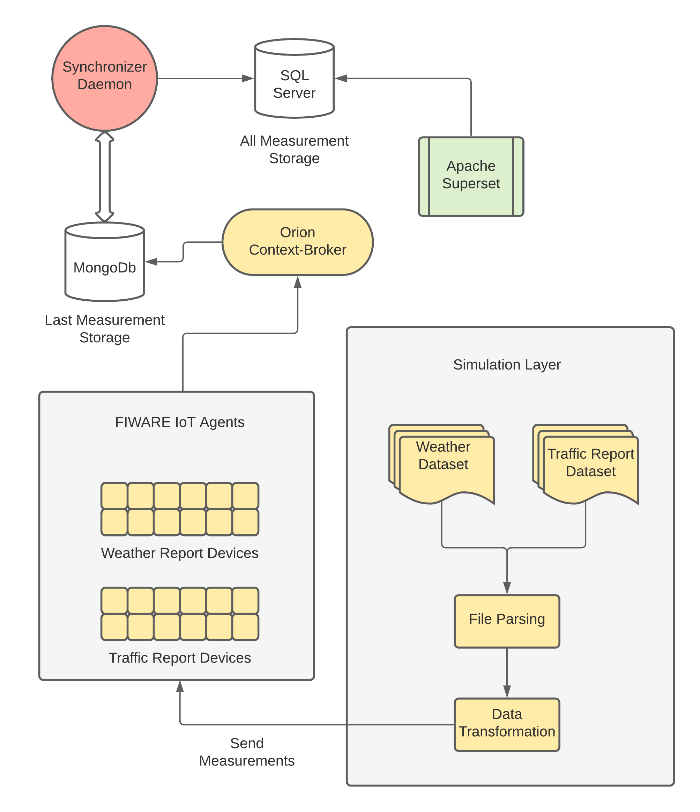

# FIWAREHub
> FIWARE as a means of big data analysis.

FIWAREHub was released as a dissertation for my academic studies.
It serves the purpose of creating a FIWARE ecosystem in order to analyze big data.
In my case, FIWARE IoT agents were provisioned as a simulation layer for big data, fed from a dataset store.
The data was later imported into a SQL Database and analyzed further via the use of Business Intelligence software.



## Prerequisites
This solution has been developed using Microsoft dotnet Core.
Dotnet core in itself is cross-platform and should run on all OS environments.
There are no extra requirements, other than the Docker-Engine


## Installation

OS X & Linux:

```sh
git clone https://github.com/petsasj/InformationSystems.git
```

Windows:
Download repository via Github and unzip.

Open terminal/console targetting the root folder. 

```sh
docker-compose build
docker-compose up -d
```

## Usage example

After verifying that you are meeting all the installation requirements (and downloaded the datasets from the above links), proceed below.

To get started, after cloning the git repository do the following:
* Navigate into the root folder. 
* Modify the .env file according to your needs.
* Make sure that you modify the NETWORKMODE attribute. In its default setting it is setup for use in a custom Docker network. Default values are host or bridge.
* Set Database passwords according to your needs
* Run docker-compose build
* Run docker-compose up -d
* Using the POSTMAN Collections below, provision both JSON and UltraLight devices
* That's it!

Any measurement posted in either of the JSON Devices or UltraLight Devices will be synchronized both into Microsoft SQL Server and Apache-Superset.


## POSTMAN Collections

The following POSTMAN Collection corresponds to the Web API Actions within the application FIWAREHub.Web

Namely the most useful actions are:
* Provision JSON Devices
* Provision Ultralight Devices
* Test Weather Measurement (via JSON)
* Test Road Measurement (via Ultralight)

[](https://app.getpostman.com/run-collection/32def79f490a71477dc0)

The following POSTMAN Collection summarizes all requests for FIWARE IoT Agents and Orion.
The names are pretty explanatory and descriptions have been added within them.

[](https://app.getpostman.com/run-collection/0366d7edf1b7f748dcd0)

## Release History
* 1.0.0
	* Initial Release
* 0.2.0
	* Software architecture implemented
* 0.0.1
    * Work in progress

## Meta

Yiannis Petsas - el05628@mail.ntua.gr

 Distributed under the GPL license. See ``LICENSE`` for more information.

[https://github.com/petsasj/InformationSystems](https://github.com/petsasj/)

## Contributing

1. Fork it (<https://github.com/petsasj/InformationSystems/fork>)
2. Create your feature branch (`git checkout -b feature/fooBar`)
3. Commit your changes (`git commit -am 'Add some fooBar'`)
4. Push to the branch (`git push origin feature/fooBar`)
5. Create a new Pull Request

<!-- Markdown link & img dfn's -->
[npm-image]: https://img.shields.io/npm/v/datadog-metrics.svg?style=flat-square
[npm-url]: https://npmjs.org/package/datadog-metrics
[npm-downloads]: https://img.shields.io/npm/dm/datadog-metrics.svg?style=flat-square
[travis-image]: https://img.shields.io/travis/dbader/node-datadog-metrics/master.svg?style=flat-square
[travis-url]: https://travis-ci.org/dbader/node-datadog-metrics
[wiki]: https://github.com/yourname/yourproject/wiki